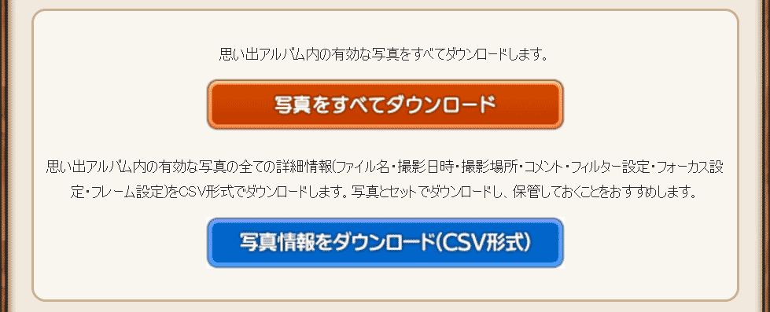

# ドラゴンクエスト X 思い出アルバム画像詳細情報保存ブックマークレット



## ブックマークレット

以下の文字列を URL としてブックマークに登録して下さい。

```
javascript:(function(){var a='https://cdn.jsdelivr.net/gh/mangabuta/dump_images@master/csv-download.min.js?'+(new Date()).getTime();var d=document;var e=d.createElement('script');e.charset='utf-8';e.src=a;d.getElementsByTagName('head')[0].appendChild(e);})();
```

利用する際は、「目覚めし冒険者の広場」にログインし、「思い出アルバム」のページを表示してからブラウザに登録したブックマークレットを起動して下さい。

## 説明

### これは何？

ドラゴンクエスト X プレイヤー用サイト「目覚めし冒険者の広場」の「思い出アルバム」の「写真をすべてダウンロード」ボタンでは、写真画像のみがダウンロードされます。
そのため、写真の撮影場所やフィルター・フォーカス・フレームなどの撮影設定情報は「思い出アルバム」の写真が上書き等でなくなった時点で失われてしまいます。

このブックマークレットは、そのような写真の詳細情報を写真のファイル名と紐付けしたデータを持つ CSV ファイルとして
ダウンロードするボタンを「思い出アルバム」の「写真を全てダウンロード」ボタンの下に追加します。

CSV ファイルの内容は過去に写真の一括保存ができるブックマークレットから保存できたものの上位互換です。
CSV ファイルには各写真の「ファイル名・撮影日時・撮影場所・コメント・フィルター設定・フォーカス設定・フレーム設定」が含まれます。

CSV 形式のファイルと写真画像を両方保存しておくことで、将来これらを利用した思い出アルバム用の PC アプリなどを作成し、
ドラゴンクエスト X の写真を大量に管理することができるようになるかもしれません。

### 動かない＆こんな機能欲しい

イシューに報告して頂くか、Twitter で[@mangabuta](https://twitter.com/mangabuta)までご連絡下さい。
